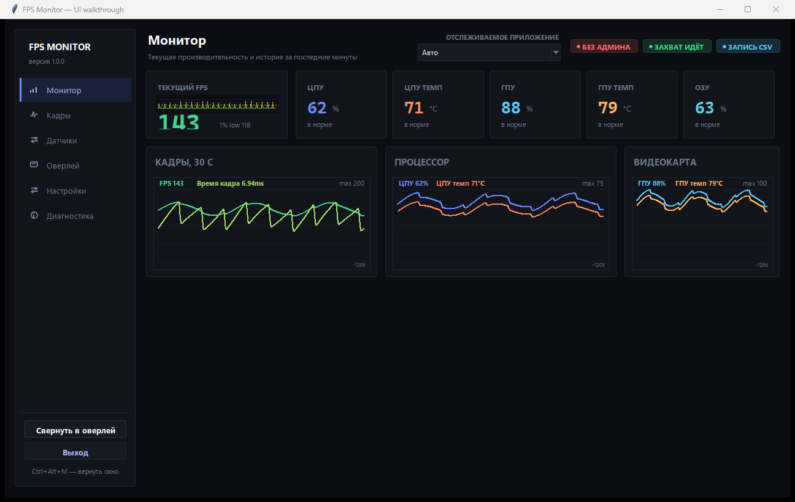
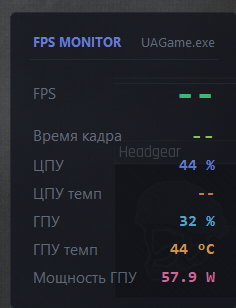

# FPS Monitor

Монитор игровой производительности для Windows: **FPS**, **время кадра**, **1% low**,
**температура и загрузка CPU**, **температура, загрузка, VRAM, мощность и частоты GPU**,
**оперативная память** — в компактном оверлее поверх игры и в отдельном окне с графиками.

Проверено на: Windows 11 (26100), AMD Ryzen 7 5700X, NVIDIA GeForce RTX 4070, Python 3.14.



---

## Интерфейс

Боковое меню, шесть страниц:

| Страница | Что показывает |
|---|---|
| **Монитор** | крупный текущий FPS с мини-графиком, плитки ЦПУ/ГПУ/ОЗУ, три графика истории |
| **Кадры** | график времени кадра (5/10/30/60 с; режимы «время кадра» и «FPS»), плитки: средний, лучший и худший кадр, 1% и 0.1% low, статтеры |
| **Датчики** | все метрики списком: кадры, процессор, память, видеокарта, приложение |
| **Оверлей** | какие строки показывать, положение, прозрачность, масштаб, поведение |
| **Настройки** | периоды опроса и окна расчёта, источники, запись в CSV, горячие клавиши |
| **Диагностика** | состояние каждого источника, права администратора, драйвер датчиков CPU, пути и действия |

**График времени кадра** рисует каждый кадр отдельно: несколько кадров, попавших в один
пиксель, схлопываются в худший, поэтому одиночные просадки не растворяются в среднем.
Пунктиром отмечены уровни 60 и 30 FPS. Шкала «Авто» подстраивается по 95-му процентилю, а не
по максимуму — иначе одна просадка на 100 мс сплющивает весь график.

**Алерты по железу** (как в оригинальном FPS Monitor): значения выше порога подсвечиваются —
янтарным при подходе к критическому, красным при критическом. Пороги: ЦПУ 85/95 °C,
ГПУ 80/89 °C, hot spot 95/105 °C, видеопамять 92/98 %, ОЗУ 90/96 %.

**Оверлей** — скруглённая полупрозрачная панель поверх игры: заголовок с именем приложения,
крупный FPS, ниже строки датчиков, опционально мини-график времени кадра.



---

## Быстрый старт

1. Двойной щелчок по **`FpsMonitor.cmd`** (или ярлык «FPS Monitor» после установки).
2. Подтвердите запрос **UAC** — без прав администратора FPS и температура CPU недоступны.
3. Оверлей появится в левом верхнем углу, окно с графиками откроется рядом.

### Сборка из исходников (этот репозиторий)

В репозитории только код: сторонние бинарники и psutil скачиваются скриптами
(подробности и лицензии — в [THIRD_PARTY.md](THIRD_PARTY.md)).

```powershell
git clone https://github.com/HunterD-LevelMax/fpsMonitor.git
cd fpsMonitor
python tools\fetch_vendor.py     # PresentMon + LibreHardwareMonitor -> vendor/
python tools\fetch_psutil.py     # psutil -> libs/
install.ps1                      # ярлыки и копия в %LOCALAPPDATA%, либо сразу FpsMonitor.cmd
```

Готовая сборка, которой не нужен установленный Python, лежит в разделе **Releases**
(`FpsMonitor-portable.zip`): распаковать и запустить `Запуск.cmd`.

Требуется Python 3.10+ (проверено на 3.14).

### Установка в систему

Установка в `%LOCALAPPDATA%\FpsMonitor` с ярлыками на рабочем столе и в меню «Пуск»:

```powershell
powershell -ExecutionPolicy Bypass -File install.ps1
```

Удаление: `powershell -ExecutionPolicy Bypass -File install.ps1 -Uninstall`

---

## Горячие клавиши

| Клавиши | Действие |
|---|---|
| `Ctrl+Alt+O` | показать / скрыть оверлей |
| `Ctrl+Alt+L` | заблокировать / разблокировать клики по оверлею |
| `Ctrl+Alt+M` | показать / скрыть окно с графиками |

**Значок в трее.** Приложение живёт в области уведомлений (рядом с часами, в «скрытых
значках»). Левый клик по значку — открыть окно, правый — меню: показать окно, включить или
выключить оверлей, разрешить клики сквозь оверлей, выход. Подсказка при наведении показывает
текущий FPS, активное приложение и температуру CPU.

**Окно и выход.** Крестик в углу окна **не закрывает приложение** — он только скрывает окно,
оверлей и сбор метрик продолжают работать (иначе кажется, что «всё пропало»). Вернуть окно —
значок в трее, `Ctrl+Alt+M` или ярлык. Полностью закрыть приложение — **«Выход»** в меню трея
или кнопка в правом верхнем углу окна.

Чтобы **передвинуть оверлей**: `Ctrl+Alt+L` (клики перестанут проходить сквозь), перетащите
мышью, затем верните блокировку.

---

## Что и как измеряется

| Метрика | Источник | Нужен админ |
|---|---|---|
| FPS, время кадра, 1% low | [PresentMon](https://github.com/GameTechDev/PresentMon) — ETW-провайдер `Microsoft-Windows-DxgKrnl`, то есть реальные кадры, отданные на экран | **да** |
| Температура CPU, мощность пакета, частота | [LibreHardwareMonitor](https://github.com/LibreHardwareMonitor/LibreHardwareMonitor) (`LibreHardwareMonitorLib.dll`, драйвер Ring0 / PawnIO) | **да** |
| Загрузка CPU по ядрам, RAM, CPU процесса | [psutil](https://github.com/giampaolo/psutil) (в комплекте в `libs/`) | нет |
| Загрузка, температура, VRAM, мощность, частоты, кулер GPU | `nvidia-smi` из драйвера NVIDIA | нет |
| Точка доступа/хотспот, память GPU | LibreHardwareMonitor (резервный источник) | нет |

FPS считается как **число кадров за последнее окно** (по умолчанию 1 с), а не как
`1000 / среднее время кадра` — это устойчивее к пропускам кадров. «1% low» — среднее
худших 1% времён кадров за окно (по умолчанию 10 с).

Активное приложение выбирается автоматически: приоритет у окна в фокусе, при
переключении оно удерживается 6 секунд, иначе берётся самый нагруженный источник кадров
(обычно это запущенная игра). В списке «Отслеживаемое приложение» можно закрепить процесс
вручную.

---

## Окно настроек

* **Оверлей** — набор строк, положение (4 угла или своё место), прозрачность, масштаб,
  заголовок, сквозные клики.
* **Настройки** — период опроса, длина окна графиков, окно расчёта FPS и 1% low, номер GPU,
  включение источника температуры CPU, запись всех метрик в CSV.
* **Диагностика** — состояние каждого источника, признак запуска от администратора,
  ошибки цикла опроса, кнопки «Самопроверка в консоли», «Перезапустить захват FPS»,
  открытие папок приложения и логов.

CSV-логи складываются в `logs\fpsmon-ГГГГММДД-ЧЧММСС.csv`, удобно открывать в Excel.

---

## Если что-то не работает

| Симптом | Причина и решение |
|---|---|
| FPS и температура CPU пустые | Приложение запущено без прав администратора. Запускайте через `FpsMonitor.cmd`, подтвердите UAC. |
| Нет температуры CPU и мощности CPU (нули), хотя права администратора есть | Windows 11 блокирует драйвер WinRing0 — он в списке уязвимых драйверов Microsoft (`VulnerableDriverBlocklistEnable = 1`). Откройте вкладку **«Диагностика»** и нажмите **«Установить драйвер датчиков (PawnIO)»** — см. раздел ниже. |
| Оверлей не виден в игре | Игра в эксклюзивном полноэкранном режиме перекрывает любые наложения. Переключите игру в безрамочный/оконный режим. |
| Нет метрик GPU | Нет `nvidia-smi.exe` (нет драйвера NVIDIA или карта не NVIDIA). Остальное приложение работает. |
| Приложение уже запущено | Работает один экземпляр (мьютекс), закройте прежний. |
| Что-то упало | Смотрите `logs\crash.log` и вкладку «Диагностика». |
| Показания «замерли» | Источник, переставший отвечать, автоматически обнуляется через 3–5 с, а не тянет последнее значение бесконечно. |

### Драйвер датчиков CPU (PawnIO)

Температуру, мощность и частоты ядер нельзя прочитать из пользовательского режима — нужен
драйвер. LibreHardwareMonitor исторически использует WinRing0, а **Microsoft внесла WinRing0
в список уязвимых драйверов**, поэтому на актуальной Windows 11 драйвер молча не загружается:
все датчики CPU отдают 0, а GPU-датчики (NVAPI) продолжают работать.

LibreHardwareMonitor 0.9.6 умеет работать через **PawnIO** — подписанный «scriptable universal
kernel driver» ([pawnio.eu](https://pawnio.eu/), автор namazso). Его установщик встроен прямо
в `LibreHardwareMonitor.exe`, поэтому приложение ставит драйвер offline:

* кнопка **«Установить драйвер датчиков (PawnIO)»** на вкладке «Диагностика»;
* из консоли: `python -m app.sources.pawnio install` (нужны права администратора);
* вручную: распаковать ресурс `LibreHardwareMonitor.Resources.PawnIO_setup.exe` и выполнить
  `PawnIO_setup.exe -install`.

Драйвер ничего не устанавливает без вашего действия: без нажатия кнопки он не ставится.
Удаление — через «Установка и удаление программ» (PawnIO) или `PawnIO_setup.exe -uninstall`.

Проверить состояние: `python -m app.sources.pawnio` (показывает, установлен ли драйвер и
какая именно причина мешает датчикам).

Headless-проверка всех источников без графического интерфейса:

```powershell
C:\Python314\python.exe tools\selftest.py 8
```

---

## Структура проекта

```
FpsMonitor/
  FpsMonitor.cmd          запуск с самоповышением прав (UAC)
  install.ps1             установка в %LOCALAPPDATA% + ярлыки
  app/
    main.py               точка входа, один экземпляр, цикл UI, хоткеи
    tray.py               значок в трее (Shell_NotifyIcon, чистый ctypes)
    fpsmonitor.ico        иконка окна, трея и ярлыка
    config.py             настройки (config.json рядом с приложением)
    metrics.py            реестр метрик: подписи, единицы, форматирование
    state.py              последние значения + история для графиков
    sampler.py            опрос источников, слияние метрик, CSV-лог
    csvlog.py             запись сессии в CSV
    winutil.py            ctypes: активное окно, сквозные клики, DPI, хоткеи
    sources/
      nvidia.py           nvidia-smi
      system.py           psutil (+ резерв на ctypes)
      lhm.py              мост к LibreHardwareMonitorLib.dll
      lhm_bridge.ps1      PowerShell-мост (net472-сборка грузится в PS 5.1)
      presentmon.py       разбор CSV-потока PresentMon -> FPS
    ui/
      overlay.py          оверлей поверх игр
      dashboard.py        окно: страницы, карточки, настройки, диагностика
      widgets.py          карточки, плитки, «пилюли», тумблеры, слайдеры, меню
      framegraph.py       график времени кадра
      graph.py            график на Canvas без внешних библиотек
      theme.py            дизайн-токены: цвета, шрифты, отступы
  libs/                   psutil (создаётся tools/fetch_psutil.py, в git не хранится)
  vendor/                 PresentMon и LibreHardwareMonitor
                          (создаётся tools/fetch_vendor.py, в git не хранится)
  tools/
    fetch_vendor.py       скачать PresentMon и LibreHardwareMonitor
    fetch_psutil.py       распаковать psutil в libs/
    make_icon.py          нарисовать app/fpsmonitor.ico
    make_portable.py      собрать dist/FpsMonitor-portable.zip (со своим Python)
    test_frames.py        проверка расчёта FPS на синтетическом захвате
    selftest.py           проверка источников из консоли
  THIRD_PARTY.md          лицензии сторонних компонентов
```

### Почему PowerShell-мост, а не WMI

LibreHardwareMonitor **удалил WMI-провайдер**, а его веб-сервер включается только вручную
из меню. Зато `LibreHardwareMonitorLib.dll` собран под **.NET Framework 4.7.2**, а Windows
PowerShell 5.1 работает именно на .NET Framework 4.x — поэтому библиотека грузится
напрямую, без Python-обвязок и без установки .NET SDK.

Библиотека при старте копируется в `%LOCALAPPDATA%\FpsMonitor\lib\` — .NET отказывается
загружать сборки из некоторых перенаправленных путей (`HRESULT 0x80131515`), да и так
приложение работает из любого каталога.

---

## Зависимости и лицензии

| Компонент | Версия | Лицензия |
|---|---|---|
| PresentMon (Intel) | 2.6.0 | MIT |
| LibreHardwareMonitor | 0.9.6 | MPL-2.0 |
| psutil | 7.2.2 | BSD-3-Clause |

Скачать заново: `python tools\fetch_vendor.py` и `python tools\fetch_psutil.py`.
Требуется Python 3.10+ (проверено на 3.14).
